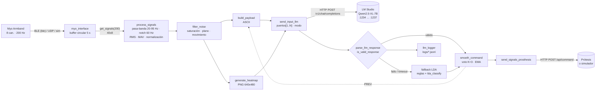
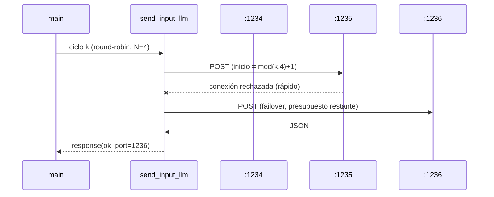

# Arquitectura

> English: [architecture.md](architecture.md)

## Vista general



## Tiempos del ciclo (N = 1, imagen figure, valores de referencia)

| Etapa | Tiempo típico |
|---|---|
| `get_signals` (lectura del buffer) | < 2 ms |
| `process_signals` + `filter_noise` | 1–3 ms |
| `build_payload` | < 1 ms |
| `generate_heatmap` (`figure` / `raster`) | 30–80 ms / 2–5 ms |
| Base64 + JSON | 1–3 ms |
| **LLM (Qwen2.5-VL-7B, en caliente)** | **300–1500 ms según la GPU y el tamaño de la imagen** |
| `smooth_command` + POST a la prótesis | 5–30 ms |

El LLM domina el ciclo. `timeout` fija la espera máxima por ciclo. Cuando se agota, el LDA
decide ese ciclo (< 1 ms) y la prótesis nunca se queda sin comando.

## Componentes y responsabilidades

| Capa | Módulo | Responsabilidad | Depende de |
|---|---|---|---|
| Adquisición | `myo_interface`, `get_signals`, `calibrate` | Muestras, buffer, calibración | `ble`, `udpport` (MATLAB base) |
| Procesamiento | `process_signals`, `filter_noise`, `normalize_signals` | Rasgos y estado | Signal Processing Toolbox |
| Representación | `build_payload`, `generate_heatmap` | Entradas del LLM (texto + imagen) | gráficos de MATLAB base |
| Inferencia | `send_input_llm`, `build_request_body`, `parse_llm_response`, `is_valid_response` | Clasificación principal | `webwrite`, `jsonencode` |
| Respaldo | `train_lda`, `lda_classify`, `is_composite_gesture`, `rms_to_value` | Clasificación de emergencia | (opcional) Statistics Toolbox |
| Control | `smooth_command`, `send_signals_prosthesis` | Estabilidad y actuación | `webwrite` |
| Observabilidad | `logger`, `llm_logger`, `main_debug` | Logs, estadísticas, panel | — |

## Abstracción de puertos (N = 1 ↔ N = 4)



- La lista de puertos, los modelos y el modo vienen **solo** de `server-llm.mat`.
- `for idx = order` recorre igual con N = 1 y con N = 4.
- El contador del round-robin es `persistent` y se reinicia con `send_input_llm('reset')`.
- `parallel` usa `parfeval(backgroundPool, @webwrite, …)` (MATLAB base, sin Parallel
  Computing Toolbox). Si `webwrite` no funciona en hilos, `send_input_llm` pasa de forma
  permanente a modo secuencial durante el resto de la sesión.

## Invariantes

1. **El LLM se llama en cada ciclo**, incluso en `REST` o `NOISE`, y aunque el ciclo
   anterior haya fallado (`summary.llm_calls == summary.cycles`).
2. **El LLM siempre recibe TEXTO + IMAGEN.** `build_request_body` falla si no hay imagen.
3. **El LDA solo actúa cuando el LLM falla** (`source = 'lda'` en el log).
4. **Una sola tabla de reglas.** `label_to_finger`, `rms_to_value` e `is_composite_gesture`
   reflejan el prompt, y `test_payload` lo comprueba.
5. **Cierre seguro.** `onCleanup` envía `#R`, libera el Myo y cierra los logs, incluso tras
   Ctrl+C.

## Formato del log por ciclo (`logs/llm_*.jsonl`)

```json
{"cycle":12,"t_ms":2410,"state":"ACTIVE","noise_reason":"","payload":"RMS:[...]...",
 "llm_ok":true,"llm_valid":true,"llm_error":"","llm_content":"{...}","llm_latency_ms":642.1,
 "port":1234,"attempts":1,"source":"llm","command":"B","action":"flex","value":95,
 "confidence":0.92,"smoothed_command":"B","smoothed_value":93,"smoothing":"ema",
 "prosthesis_ok":true,"prosthesis_latency_ms":12.3,"cycle_ms":711.8}
```
