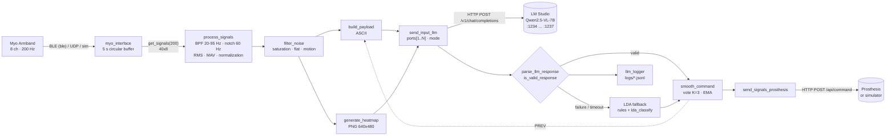
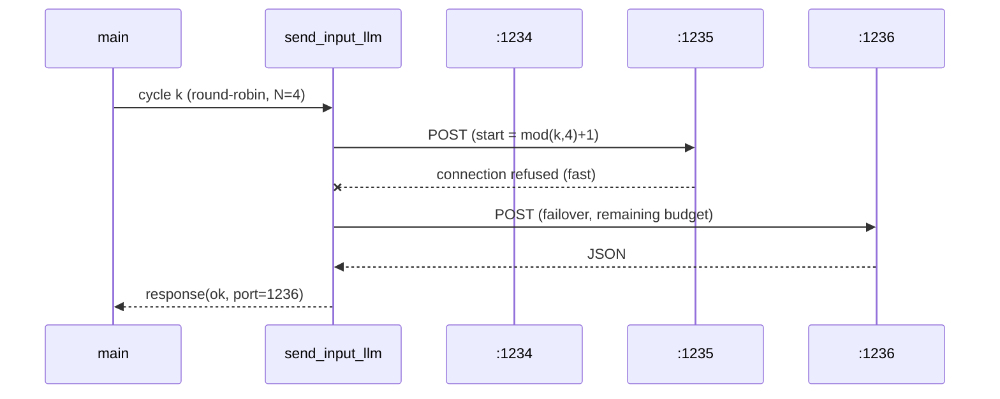

# Architecture

> Español: [architecture.es.md](architecture.es.md)

## Overview



## Cycle timing (N = 1, figure image, reference values)

| Stage | Typical time |
|---|---|
| `get_signals` (buffer read) | < 2 ms |
| `process_signals` + `filter_noise` | 1–3 ms |
| `build_payload` | < 1 ms |
| `generate_heatmap` (`figure` / `raster`) | 30–80 ms / 2–5 ms |
| Base64 + JSON | 1–3 ms |
| **LLM (Qwen2.5-VL-7B, warm)** | **300–1500 ms depending on GPU and image size** |
| `smooth_command` + prosthesis POST | 5–30 ms |

The LLM dominates the cycle. `timeout` sets the maximum wait per cycle. When it runs out,
the LDA decides that cycle (< 1 ms) and the prosthesis never goes without a command.

## Components and responsibilities

| Layer | Module | Responsibility | Depends on |
|---|---|---|---|
| Acquisition | `myo_interface`, `get_signals`, `calibrate` | Samples, buffer, calibration | `ble`, `udpport` (base MATLAB) |
| Processing | `process_signals`, `filter_noise`, `normalize_signals` | Features and state | Signal Processing Toolbox |
| Representation | `build_payload`, `generate_heatmap` | LLM inputs (text + image) | base MATLAB graphics |
| Inference | `send_input_llm`, `build_request_body`, `parse_llm_response`, `is_valid_response` | Primary classification | `webwrite`, `jsonencode` |
| Fallback | `train_lda`, `lda_classify`, `is_composite_gesture`, `rms_to_value` | Emergency classification | (optional) Statistics Toolbox |
| Control | `smooth_command`, `send_signals_prosthesis` | Stability and actuation | `webwrite` |
| Observability | `logger`, `llm_logger`, `main_debug` | Logs, statistics, dashboard | — |

## Port abstraction (N = 1 ↔ N = 4)



- The port list, the models and the mode come **only** from `server-llm.mat`.
- `for idx = order` iterates the same way for N = 1 and N = 4.
- The round-robin counter is `persistent` and is reset with `send_input_llm('reset')`.
- `parallel` uses `parfeval(backgroundPool, @webwrite, …)` (base MATLAB, no Parallel
  Computing Toolbox). If `webwrite` is not supported in threads, `send_input_llm` switches
  permanently to sequential mode for the rest of the session.

## Invariants

1. **The LLM is called on every cycle**, even in `REST` or `NOISE`, and even if the
   previous cycle failed (`summary.llm_calls == summary.cycles`).
2. **The LLM always receives TEXT + IMAGE.** `build_request_body` fails if there is no
   image.
3. **The LDA only acts when the LLM fails** (`source = 'lda'` in the log).
4. **A single rule table.** `label_to_finger`, `rms_to_value` and `is_composite_gesture`
   mirror the prompt, and `test_payload` checks it.
5. **Safe shutdown.** `onCleanup` sends `#R`, releases the Myo and closes the logs, even
   after Ctrl+C.

## Per-cycle log format (`logs/llm_*.jsonl`)

```json
{"cycle":12,"t_ms":2410,"state":"ACTIVE","noise_reason":"","payload":"RMS:[...]...",
 "llm_ok":true,"llm_valid":true,"llm_error":"","llm_content":"{...}","llm_latency_ms":642.1,
 "port":1234,"attempts":1,"source":"llm","command":"B","action":"flex","value":95,
 "confidence":0.92,"smoothed_command":"B","smoothed_value":93,"smoothing":"ema",
 "prosthesis_ok":true,"prosthesis_latency_ms":12.3,"cycle_ms":711.8}
```
